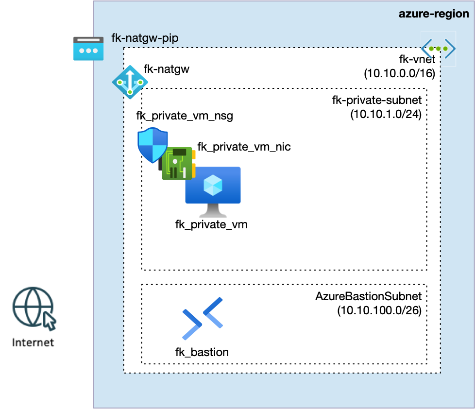
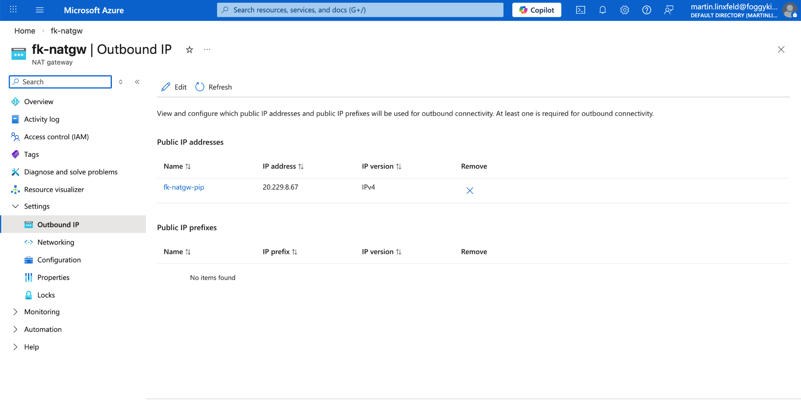
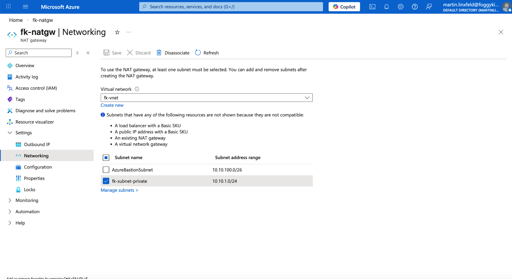

# Example 01: Private Subnet with NAT Gateway (Outbound-Only Internet Access)

In this example, we deploy a **private Linux Virtual Machine** into a **private subnet**
with **egress-only Internet access provided by Azure NAT Gateway**.

The VM has **no public IP address**. All outbound traffic (package updates, external APIs)
is routed through a **NAT Gateway with a stable public IP**, while inbound access remains private
(via Azure Bastion tunneling in operator workflows).

This example establishes the **clean baseline for private workloads that still require Internet egress**.

---

## 🧭 Architecture Overview

This deployment creates a Virtual Network using the
`terraform-az-fk-vnet` module.

The Virtual Network contains:
- a **private subnet** for workloads,
- an **AzureBastionSubnet** for secure operator access,
- a **NAT Gateway** associated with the private subnet for outbound Internet connectivity.

The VM is deployed into the **private subnet** and has **no public IP**.
All outbound traffic flows through the **NAT Gateway public IP**.



*Figure 1. Private subnet with NAT Gateway providing outbound Internet access for private VMs.*

This example creates:
- A **Virtual Network** and **subnets** via `terraform-az-fk-vnet`
- A single **private Linux Virtual Machine** via `terraform-az-fk-compute`
- A dedicated **Network Interface (NIC)** via `terraform-az-fk-compute`
- A **NIC-level Network Security Group** via `terraform-az-fk-nsg`
- An **Azure NAT Gateway** with a **public IP** via `terraform-az-fk-natgw`
- (Optional) **Azure Bastion** via `terraform-az-fk-bastion` for private operator access
- No public IP addresses on VMs
- No Load Balancer
- No autoscaling

This is still a **foundation example**, focused on **egress design patterns**.

---

## 🎯 Why this example exists

In real Azure platforms:
- private subnets often need **outbound Internet access** (OS updates, package repos, APIs),
- public IPs on VMs are **not acceptable** for production workloads,
- outbound IP identity must be **stable and auditable** (for allowlists, SaaS integrations).

This example demonstrates:

- how to provide **controlled outbound Internet access** from a private subnet,
- why **NAT Gateway** is the correct primitive for scalable egress,
- how to avoid hidden SNAT behaviors on Load Balancers,
- how to design **egress as an explicit architectural layer**.

This example intentionally avoids:
- public IPs on VMs,
- Basic Load Balancer SNAT behavior,
- ad-hoc outbound routing.

---

## 🌐 Outbound Connectivity Model

- The VM has **no public IP address**
- The private subnet is **associated with an Azure NAT Gateway**
- All outbound traffic uses the **NAT Gateway public IP**
- Inbound access is **not exposed to the Internet**
- Operator access can be provided via **Azure Bastion tunneling**



*Figure 2. NAT Gateway with a dedicated public IP used for outbound traffic from the private subnet.*

This creates a **clear egress boundary** and a **single, stable outbound IP identity**.

---

## 🚀 Deployment Steps

```bash
tofu init
tofu plan
tofu apply
```

---

## 🧪 Test: Verify Outbound Internet via NAT Gateway

Connect to the private VM (for example via Azure Bastion tunneling), then:

```bash
curl https://ifconfig.me
```

Expected result:
- The reported public IP **matches the NAT Gateway public IP**.

Example:

```
20.229.8.67
```

You can also verify outbound connectivity via:

```bash
sudo apt update
```

Successful package index updates confirm functional outbound Internet access.

---

## 🖼️ Azure Portal View

### NAT Gateway – Outbound IP


*Figure 3. NAT Gateway outbound IP configuration in Azure Portal.*

### NAT Gateway – Subnet Association



*Figure 4. Private subnet associated with the NAT Gateway.*

---

## 🧹 Cleanup

```bash
tofu destroy
```

---

## 🪪 License

Licensed under the **Universal Permissive License (UPL), Version 1.0**.
