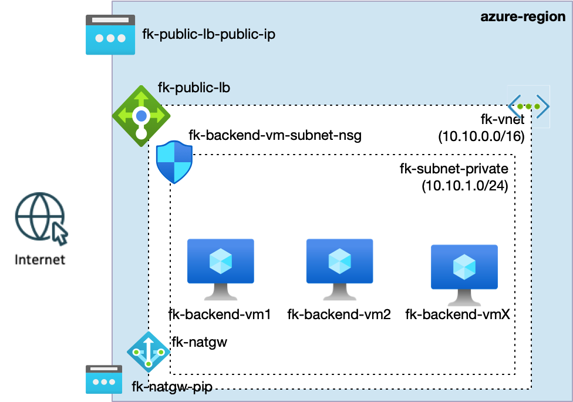
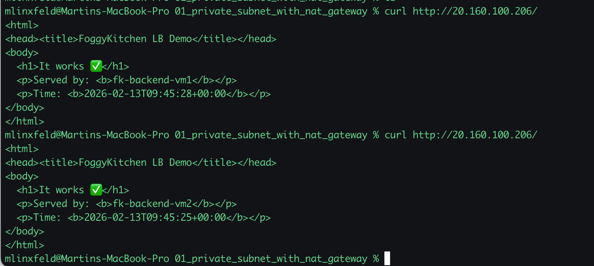
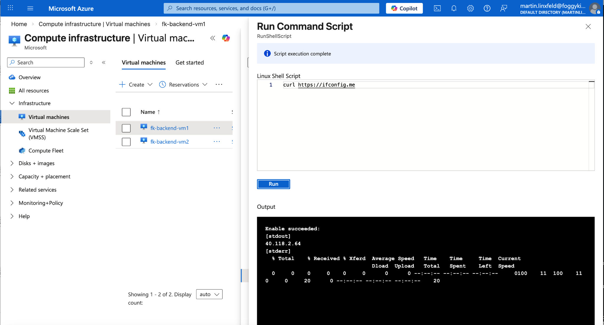

# Example 02: Private Backend Tier with Public Load Balancer and NAT Gateway

In this example, we deploy a **private backend tier** (multiple Linux Virtual Machines) behind a **public Azure Load Balancer**, while **all outbound Internet connectivity is provided explicitly via an Azure NAT Gateway**.

This pattern demonstrates a clean separation of traffic paths in Azure networking:

- **Inbound traffic** enters through a controlled public entry point (Load Balancer)
- **Outbound traffic** leaves the private subnet via a dedicated NAT Gateway
- **Workload VMs remain fully private** (no public IPs on NICs)

------------------------------------------------------------------------

## 🧭 Architecture Overview

This deployment assumes that a Virtual Network already exists (for example created using the `terraform-az-fk-vnet` module).

The Virtual Network contains:

- a **private backend subnet** for workload VMs,
- an optional **public-facing frontend** via Azure Load Balancer,
- a **NAT Gateway** associated with the private subnet to provide outbound connectivity.

The backend VMs:

- have **no public IP addresses**,
- receive inbound traffic **only via the Load Balancer**,
- access the Internet **only via the NAT Gateway**.



*Figure 1. Private backend tier behind a public Load Balancer with controlled outbound connectivity via NAT Gateway.*

This example creates:

- A **public Azure Load Balancer (Standard SKU)**  
- A **private backend subnet**  
- Multiple **private Linux Virtual Machines** (backend tier)  
- A **subnet-level Network Security Group** (tier-scoped security boundary)  
- An **Azure NAT Gateway** with a public IP  
- No public IP addresses on backend VM NICs  
- No Bastion host (operator access is intentionally out of scope)

------------------------------------------------------------------------

## 🎯 Why this example exists

In real Azure platforms, backend tiers should be:

- private by default,
- reachable only through explicit entry points (Load Balancer, Application Gateway),
- able to access the Internet only via controlled egress paths (NAT Gateway, Firewall).

This example demonstrates:

- separation of **inbound** (Load Balancer) and **outbound** (NAT Gateway) traffic paths,
- how to design a **private backend tier** without exposing public IPs on workloads,
- how NAT Gateway enables:
  - OS updates (`apt update`),
  - package downloads,
  - outbound API calls
  without weakening the inbound security model.

This is a foundational Azure networking pattern used for:

- web backend tiers,
- API tiers,
- microservice backends,
- AKS worker node subnets (egress design).

------------------------------------------------------------------------

## 🔐 Security Model

- Backend VMs have **no public IP addresses**
- NSG is attached at the **subnet level** (tier-scoped boundary)
- Inbound traffic is allowed **only from the Azure Load Balancer**
- Outbound Internet access is provided **only via NAT Gateway**
- No direct inbound SSH or RDP from the Internet

------------------------------------------------------------------------

## 🚀 Deployment Steps

```bash
tofu init
tofu plan
tofu apply
```

------------------------------------------------------------------------

## 🧪 Tests

### 1) Inbound Traffic via Public Load Balancer

From your local machine:

```bash
curl http://<public-lb-ip>
```

Expected result:

- HTTP responses returned from backend VMs
- Multiple requests should rotate across backend instances



*Figure 3. Inbound traffic distributed across private backend VMs via Azure Load Balancer.*

------------------------------------------------------------------------

### 2) Outbound Internet Access from Private Backend VMs

From one of the backend VMs (via Run Command, serial console, or temporary operator access):

```bash
curl https://ifconfig.me
```

Expected result:

- The returned IP matches the **NAT Gateway public IP**



*Figure 4. Private backend VM accessing the Internet via NAT Gateway – outbound IP matches NAT Gateway public IP.*

## 🧠 Design Notes

- Load Balancer is **not** responsible for outbound connectivity  
- NAT Gateway is **not** responsible for inbound access  
- Public IPs on workload NICs are avoided entirely  
- This pattern scales naturally to:
  - larger backend tiers,
  - VM Scale Sets,
  - AKS worker node subnets,
  - service tiers consuming private endpoints

------------------------------------------------------------------------

## 🧹 Cleanup

```bash
tofu destroy
```

------------------------------------------------------------------------

## 🪪 License

Licensed under the **Universal Permissive License (UPL), Version 1.0**.
